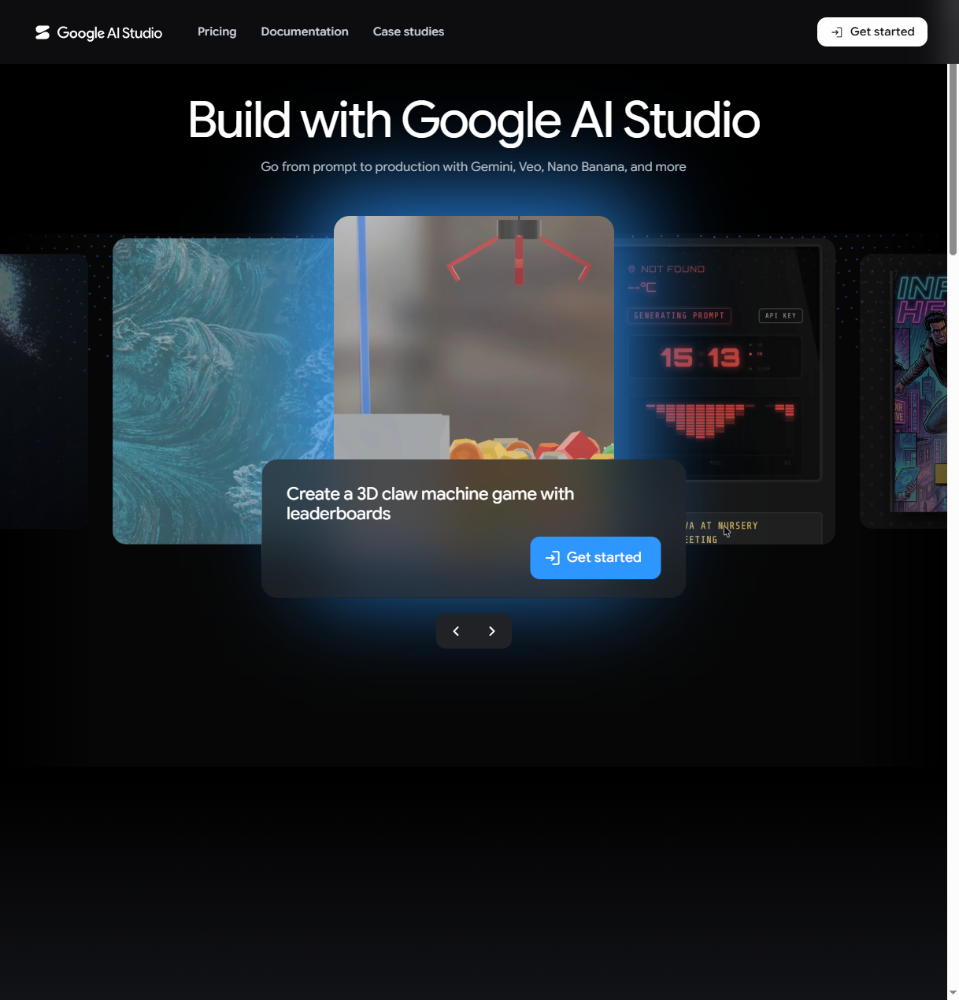

# Com obtenir una clau d'API de Google Gemini (pas a pas)

Resumir funciona amb la IA **Google Gemini**. Per fer-la servir necessites una
**clau d'API**: una contrasenya personal que connecta l'extensió amb Google.

> **És gratuïta** i sense targeta de crèdit. El nivell gratuït de Google té límits
> generosos, més que suficients per a un ús normal.
>
> **És privada.** La clau es desa **només al teu ordinador**. Resumir no té
> servidors propis: el text va directament del teu navegador a Google.

Es fa **una sola vegada** i triga un parell de minuts.

---

## Abans de començar

Necessites un **compte de Google** (el mateix del Gmail o YouTube). Si no en tens,
en pots crear un a [accounts.google.com](https://accounts.google.com/signup).

---

## Pas 1 — Obre Google AI Studio

Vés a **[aistudio.google.com](https://aistudio.google.com/)** i clica **«Get
started»**, a dalt a la dreta.

---

## Pas 2 — Inicia sessió amb Google

Si encara no ho has fet, Google et demanarà el correu i la contrasenya. La primera
vegada pot ser que hagis d'**acceptar les condicions** de Google AI Studio.

---

## Pas 3 — Vés a la pàgina de claus d'API

Obre directament **[aistudio.google.com/app/apikey](https://aistudio.google.com/app/apikey)**
(o, al menú lateral esquerre, **«Get API key»**).

---

## Pas 4 — Crea la clau

1. Clica **«Create API key»**.
2. Si et demana un **projecte**, accepta el que t'ofereix o crea'n un de nou (el nom
   és igual; només serveix per organitzar).
3. En uns segons apareixerà la clau: un text llarg que **comença per `AIza...`**.

---

## Pas 5 — Copia la clau

Clica la icona de copiar (o selecciona-la i Ctrl+C / Cmd+C).

> Tracta-la com una contrasenya: **no la comparteixis**. Si cal, la pots esborrar i
> crear-ne una de nova des de la mateixa pàgina sempre que vulguis.

---

## Pas 6 — Enganxa-la a Resumir

Obre **Resumir → Configuració (⚙️) → Claus i models**, enganxa la clau al camp de la
**clau d'API** i desa.

---

## Pas 7 — Comprova que va

Obre un article qualsevol, obre Resumir i clica **«Resum»**. Si al cap d'uns segons
apareix el resum, ja ho tens tot a punt.

---

## Problemes habituals

**«API Key invàlida» o error d'autenticació**
Revisa que has copiat la clau sencera, sense espais al davant o al darrere.
Comprova-la a [aistudio.google.com/app/apikey](https://aistudio.google.com/app/apikey);
si cal, esborra-la i crea'n una de nova.

**El resum va lent o dóna error de límit**
El nivell gratuït té un límit de peticions per minut: espera uns segons i torna-ho a
provar. Si en fas un ús intensiu, pots activar la facturació al teu projecte de
Google per pujar els límits (opcional, de pagament).

**He perdut la clau**
Torna a [aistudio.google.com/app/apikey](https://aistudio.google.com/app/apikey): hi
tens totes les teves claus. Si no la pots recuperar, esborra-la i crea'n una de nova
(recorda enganxar la nova a la Configuració de Resumir).

---

I ara, mira què pots fer amb cada eina a la **[guia de plugins](./PLUGINS.md)**, o
torna a la **[guia d'inici](./GUIA-INICI.md)**.
